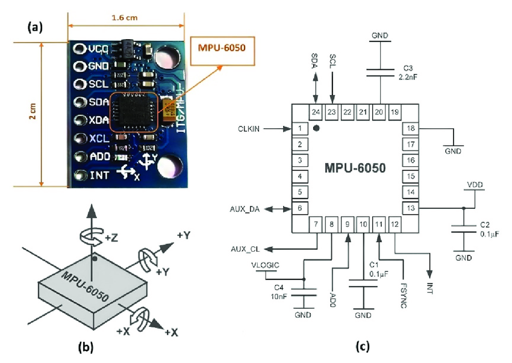
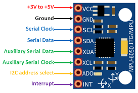

# **MPU6050 HAL Driver – Cross-Platform Driver**  
*A lightweight and portable driver for the MPU6050, compatible with STM32, ESP32, Arduino, and other microcontrollers.*  

## **Introduction**  
The **MPU6050** is a **6-axis motion tracking sensor** that combines a **3-axis accelerometer** and a **3-axis gyroscope** into a single compact package. It is widely used in applications like drones, robotics, gaming, and motion tracking due to its ability to measure both **linear acceleration** and **angular velocity**. The sensor communicates via **I2C (default)**, providing raw motion data that can be processed to determine orientation, tilt, and movement.
 
 

This driver provides **a modular and cross-platform implementation**, making it **hardware-independent** and compatible with **any HAL (Hardware Abstraction Layer).**  

## **Features**  
- **Cross-Platform** – Works with **STM32, ESP32, AVR, ARM Cortex-M, Arduino, and more**  
- **Supports Any HAL** – Uses function pointers for communication (I2C/SPI)  
- **Accelerometer, Gyroscope & Temperature Readings**  
- **Self-Test & Digital Low-Pass Filter (DLPF) Configuration**  
- **Minimal Dependencies** – Designed for embedded systems  

## **I2C Communication in MPU6050**  
The **MPU6050** uses the **I2C protocol** to communicate with microcontrollers. It has:  

- **SDA (Serial Data Line)** – Transfers data  
- **SCL (Serial Clock Line)** – Synchronizes data transfer  

**I2C Address:**  
- **0x68** (Default) when **AD0 = LOW**  
- **0x69** when **AD0 = HIGH**  

## **MPU6050 Pinout**  

| Pin  | Name  | Description |
|------|------|-------------|
| **VCC** | **Power** | Connect to **3.3V or 5V** |
| **GND** | **Ground** | Connect to **GND** |
| **SCL** | **Serial Clock** | I2C clock pin |
| **SDA** | **Serial Data** | I2C data pin |
| **XDA** | **Auxiliary Serial Data** | Used for external sensors |
| **XCL** | **Auxiliary Serial Clock** | Used for external sensors |
| **ADO** | **I2C Address Select** | Changes device I2C address |
| **INT** | **Interrupt** | Signals data availability |
